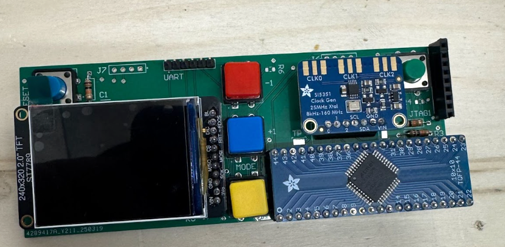
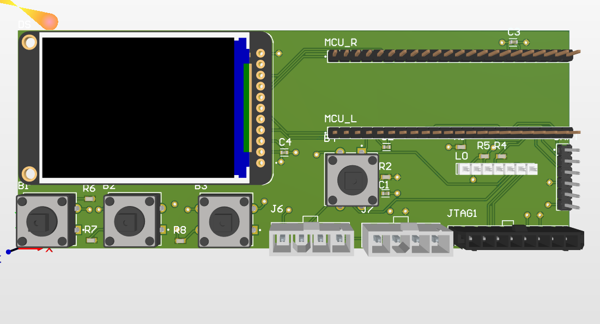
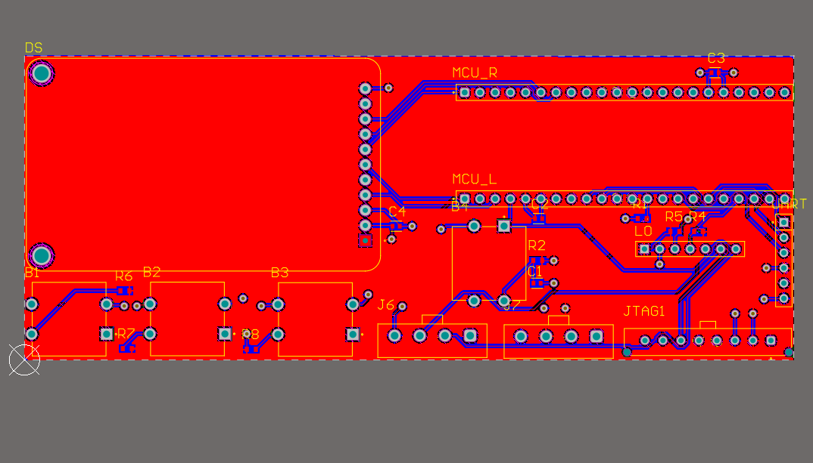
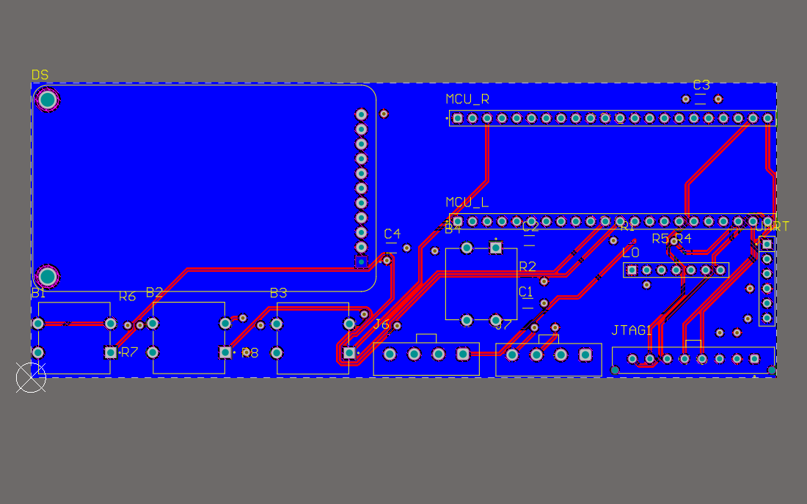
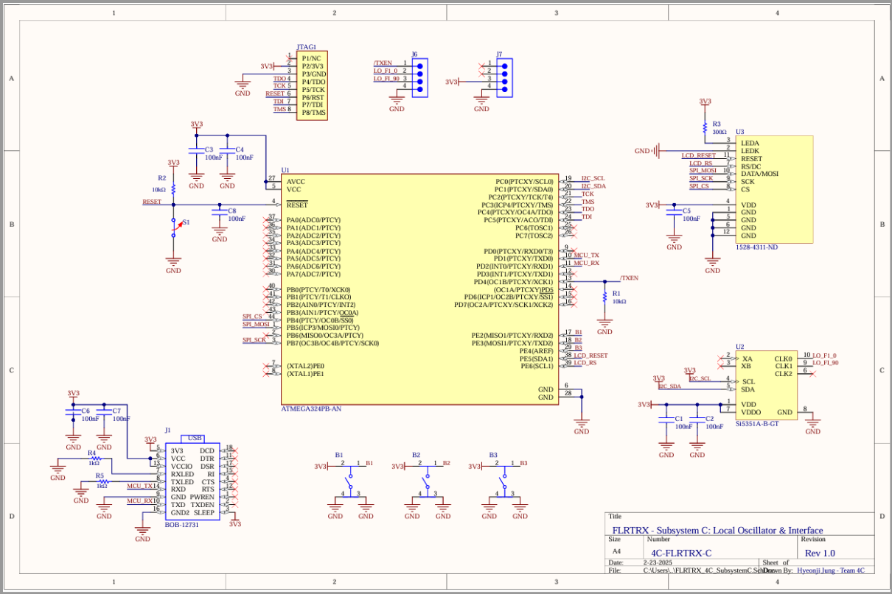
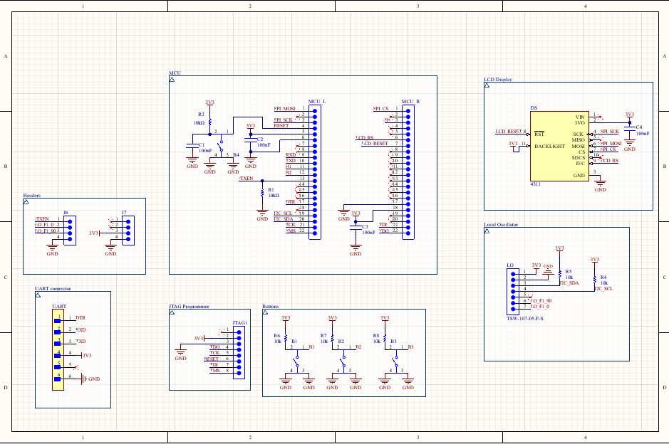

# Subsystem C: SDR Controller Hardware  
_Led a 3-person team and delivered the Technical Review Presentation as Team Lead_

**Technologies:**  Altium Designer · PCB Design · Embedded C (AVR) · ATmega324PB · Si5351A (I²C) · UART (CAT Protocol) · I²C LCD Interface · Bash & Python Scripting · Oscilloscope Validation · Git

[](LICENSE)


A high-performance hardware controller built for **Software-Defined Radio (SDR)** systems, integrating **Local Oscillator (LO) generation**, **TX/RX control**, and a **user interface** to support modular, high-accuracy signal processing.


| 3D PCB Render                                   | Assembled PCB                                   |
|:------------------------------------------------:|:------------------------------------------------:|
|    |        |

<p align="center"><b>Figure:</b> 3D PCB render (left) and fully assembled SDR controller board (right).</p>

---
## Table of Contents

- [Project Summary](#project-summary)  
- [Key Contributions & Impact](#key-contributions--impact)  
- [Getting Started](#getting-started)
- [Repo Structure](#repo-structure) 
- [Architecture](#architecture)  
- [PCB Design & Schematics](#pcb-design--schematics)
- [Validation & Test Results](#validation--test-results)
- [Supporting Materials](#supporting-materials)  
- [What We Learned](#what-we-learned)  
- [Contact & Contributors](#contact--contributors)

---

## Project Summary

This repository contains the design and firmware for **Subsystem C** of a larger SDR transceiver. It handles:

- Generating a stable, precision **10 MHz LO** for quadrature mixers  
- **TX/RX gating** via an active-low enable signal  
- A **front-panel UI** (push-buttons + 16×2 I²C LCD) for frequency tuning and mode switching  
- **Automated hardware and firmware validation** using Bash and Python test scripts  
- Full compliance with the course **Interface Control Document (ICD)**  

**Platform:** Custom 2-layer PCB (Altium Designer)  
**MCU:** ATmega324PB  
**Clock Generator:** Si5351A (I²C-programmable)  
**UI:** Push buttons + 16×2 character I²C LCD  
**Validation Tools:** Oscilloscope, Function Generator, Bash/Python automation scripts

---

## Key Contributions & Impact

- **±1 kHz LO stability** (0.01% error) and **90° I/Q phase accuracy** under lab conditions  
- **50% faster** bring-up cycles using automated Python/bash test scripts  
- Designed & PCB-routed a **compact 128 × 51 mm** daughtercard, isolating RF traces from digital noise  
- Authored the **Technical Design Document**, detailing architecture, component trade-offs, and test plans  
- Programmed embedded C for **Si5351A (I²C)**, **UART (CAT protocol)**, and **LCD control**  
- **Led a 3-member team** end-to-end: schematic → PCB → firmware → integration  
- **Presented** the M2 Technical Review, covering timing closure, signal integrity, and ICD alignment  

---

## Getting Started

```bash
# Clone the Subsystem C repo
[git clone https://github.com/hyeonjijung1/controller-hardware-sdr]
cd Controller-Hardware-for-SDR-Local-Oscillator-User-Interface

# Build firmware
make all

# Flash the ATmega324PB (via AVRDUDE or your preferred tool)
make flash
```
Once programmed, power the mainboard at 12 VDC, attach your UI module to J7/J8, and observe the LCD. Use the push-buttons to tune frequency and toggle TX/RX.

---

## 📁 Repo Structure

```bash
Controller-Hardware-for-SDR-Local-Oscillator-User-Interface/
├── docs/                     # Project documents & design slides
│   ├── ECE295_Team4C_Technical_Design_Doc.pdf
│   ├── M2_design_review_slides.pdf
│   └── Team4C_OP2_Slides.pdf
├── firmware/                 # Embedded C source & build files
│   ├── include/              # Header files
│   │   ├── Si5351.h
│   │   └── twi.h
│   ├── src/                  # Source files
│   │   ├── main.c
│   │   ├── Si5351.c
│   │   └── twi.c
│   └── Makefile
├── hardware/                 # Altium project files
│   ├── Controller_Hardware_SDR_sch.SchDoc
│   └── Controller_Hardware_SDR.PcbDoc
├── images/                   # Visuals for documentation
│   ├── 3D PCB render.png
│   ├── assembled_pcb.png
│   └── Output LO waveforms demonstrating correct phase and amplitude.png
├── scripts/                  # Test & automation scripts
│   ├── cat_test.py
│   ├── lo_auto_validation.py
│   └── test_lo_accuracy.sh
├── LICENSE
└── README.md

```

---

## Architecture


*Figure 1. Subsystem C SDR Block Diagram.*

---

## PCB Design & Schematics 

### PCB Design 

| 3D PCB Render                                | Top View                                  | Bottom View                                   |
|:---------------------------------------------:|:------------------------------------------:|:----------------------------------------------:|
|     |             |            |

<p align="center"><b>Figure:</b> 3D render, top, and bottom views of the SDR controller PCB (Altium Designer).</p>

### Schematics 


| Original Schematic                               | Final Schematic                                   |
|:------------------------------------------------:|:------------------------------------------------:|
|    |        |
<p align="center"><b>Figure:</b> Schematic in first iteration (left) and finalized Altium Schematic (right).</p>

---

## Validation & Test Results

Output LO Waveform (10 MHz, Oscilloscope)


<p align="center"><b>Figure:</b> Measured LO output at 10 MHz on oscilloscope. This demonstrates stable, low-jitter signal generation by Si5351A module. Test performed post-assembly.</p>

---

## Supporting Materials

- [Technical Design Document (PDF)](https://drive.google.com/file/d/1lXBYHzfA1NsGeK7o8hkGUYrSS2hV9RxU/view?usp=sharing)
- [M2 Technical Presentation Slides (PDF)](https://drive.google.com/drive/u/0/folders/1bPhXOaGDvTHJFP-_4Y7tE-j0aOfVJy6w)
- [OP1 General Audience Slides (PDF)](https://drive.google.com/drive/u/0/folders/1bPhXOaGDvTHJFP-_4Y7tE-j0aOfVJy6w)
- [OP2 General Audience Slides (PDF)](https://drive.google.com/drive/u/0/folders/1bPhXOaGDvTHJFP-_4Y7tE-j0aOfVJy6w)

---

## What We Learned

- Orchestrating multi-protocol I/O (I²C + UART + GPIO) on a constrained MCU  
- Achieving tight frequency tolerance within noise and thermal drift margins  
- ICD-driven design: enforcing electrical & mechanical interface specs across teams  
- PCB routing strategies to isolate analog/RF from noisy digital sections  
- Leadership: coordinating cross-functional goals, documentation, and presentations under deadline  

---
 
## About the Author

[](https://linkedin.com/in/hyeonjijung-uoft)

**Hyeonji Jung**  
Team Lead & Presenter  
junghyeonji254@gmail.com

**Contributors:**  
- Laura Marinescu  
- Chizaram Amobi-Oleka 
